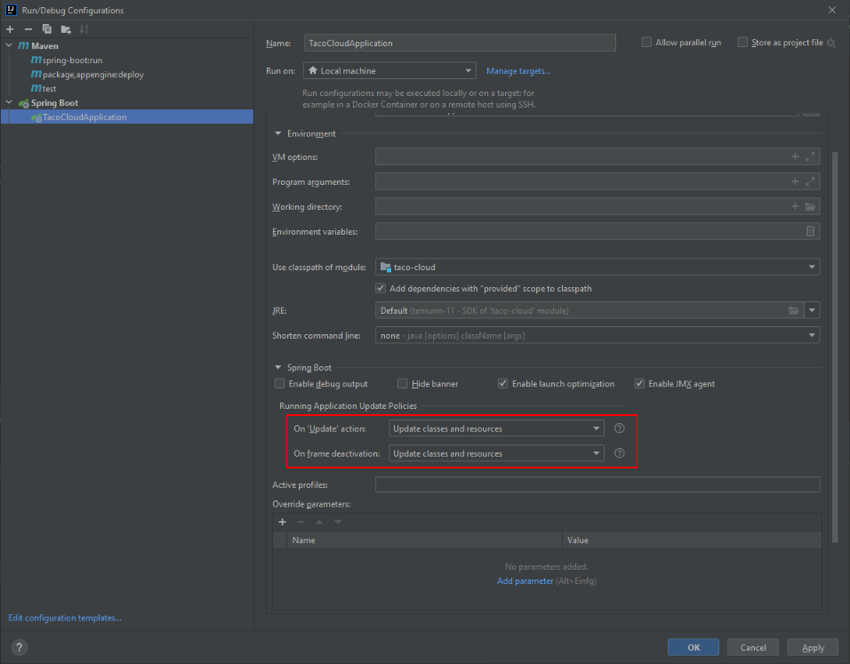
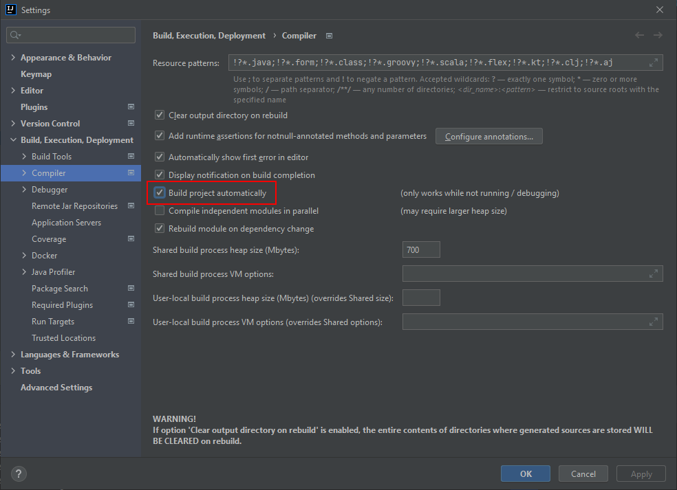

# Spring

## Spring Boot DevTools für IntelliJ

1. In `pom.xml`:
   ```
    <dependency>
            <groupId>org.springframework.boot</groupId>
            <artifactId>spring-boot-devtools</artifactId>
            <scope>runtime</scope>
            <optional>true</optional>
        </dependency>
   ```
2. Spring Boot DevTools Run Configuration: 
3. Spring Boot DevTools Compiler Settings: 

## `spring.jpa.hibernate.ddl-auto`

The standard Hibernate property values are `create`, `update`, `create-drop`, `validate` and `none`:

* `create` – Hibernate first drops existing tables and then creates new tables.
+ `update` – The object model created based on the mappings (annotations or XML) is compared with the existing schema, and then Hibernate updates the schema according to the diff. It never deletes the existing tables or columns even if they are no longer required by the application.
* `create-drop` – similar to create, with the addition that Hibernate will drop the database after all operations are completed; typically used for unit testing
* `validate` – Hibernate only validates whether the tables and columns exist; otherwise, it throws an exception.
* `none` – This value effectively turns off the DDL generation.

Spring Boot internally defaults this parameter value to `create-drop` if no schema manager has been detected, otherwise none for all other cases.